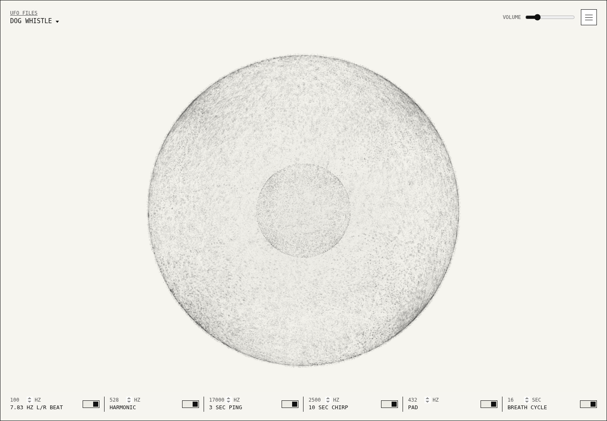
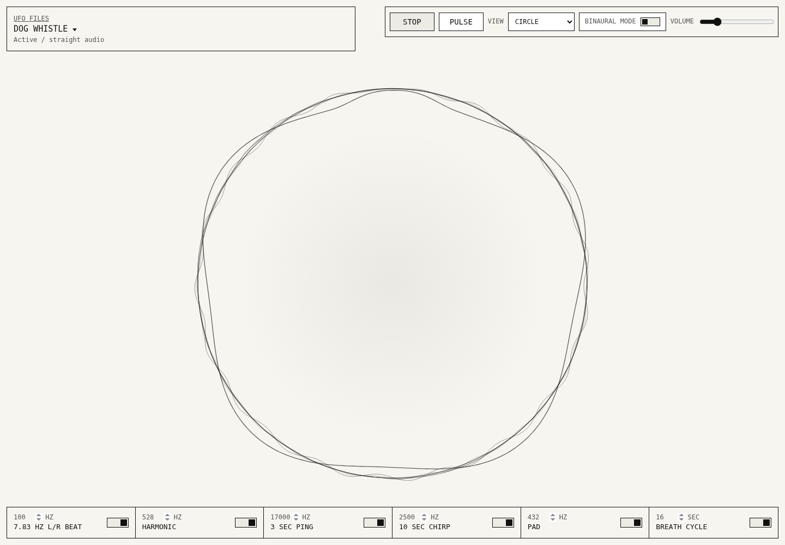
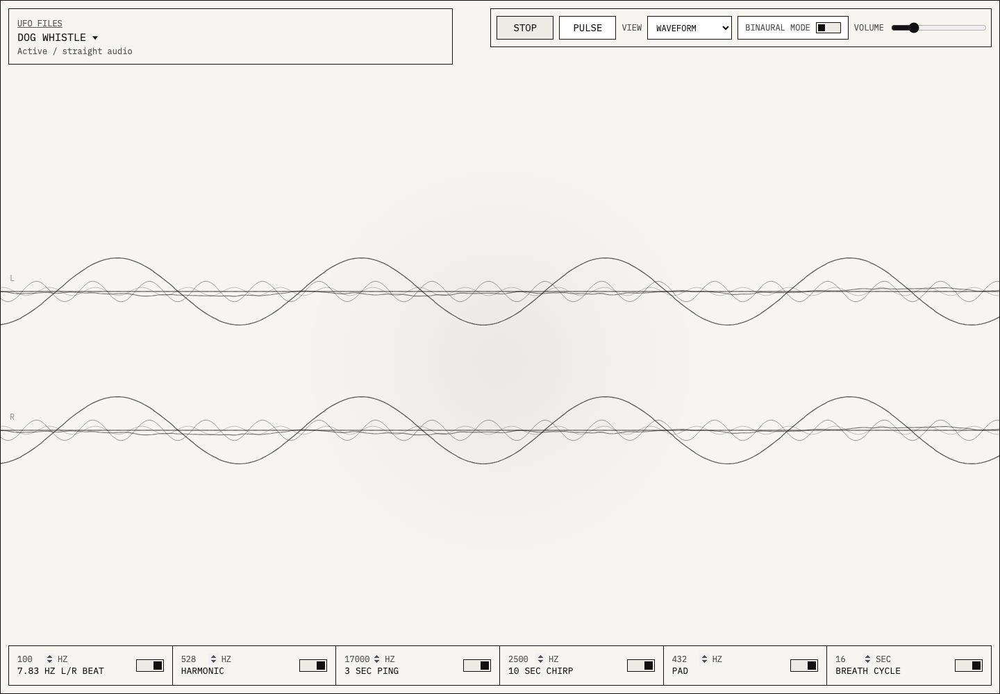

# Dog Whistle

[](https://github.com/ufo-files/dog-whistle/actions/workflows/pages.yml)

A static, browser-based Web Audio player that renders and plays a layered tone stack inspired by a public UAP "dog whistle" signal description.

Live site: https://ufo-files.github.io/dog-whistle/

Repository: https://github.com/ufo-files/dog-whistle

## Screenshots

### Sphere



### Circle



### Waveform



## What It Does

The app generates a layered stereo signal in the browser and visualizes the same generated buffers in real time. The signal includes:

- 100 Hz base tone rendered as a 7.83 Hz binaural pair in Headphones mode
- 528 Hz harmonic
- 17 kHz short ping
- 2.5 kHz chirp event every 10 seconds
- 432 Hz ambient pad
- very low-level shaped breath layer

Playback and visualization use the same generated output buffers. The frequencies are defined in the `SIGNAL` constant in `script.js`.

## Interface

- Play the signal straight.
- Pulse the signal with a slow amplitude envelope.
- Switch between Sphere, Circle, and Waveform visualizations.
- Toggle Headphones mode for the binaural carrier split.
- Switch to Speakers mode for centered mono output.
- Toggle individual sound layers on and off.
- Edit the carrier, harmonic, ping, chirp, and pad frequencies; edit the breath cycle length.
- Adjust output volume.

## Signal Design

The binaural effect is applied only to the 100 Hz carrier: left is 96.085 Hz, right is 103.915 Hz, producing a 7.83 Hz interaural difference. The 432 Hz pad, 528 Hz harmonic, 17 kHz ping, and 2.5 kHz chirp remain frequency-identical in both ears.

This keeps the binaural cue scientifically clean: one low carrier creates one interaural beat. The higher tones are not binaural-offset because simultaneous beat cues can interfere with each other, and very high or transient sounds are not reliable binaural-beat carriers.

Headphones are required for the binaural effect. Speakers acoustically mix the left and right channels in air before they reach each ear.

The app defaults to Speakers mode. The Binaural mode toggle switches to Headphones mode, which renders the 100 Hz carrier as a left/right binaural pair.

The 17 kHz ping is always part of the main signal. It is not optional or gated behind a monitor mode.

## Visual Modes

The app defaults to Sphere and has three visualization modes: Sphere, Circle, and Waveform.

- **Sphere** renders six tone-specific LED layers that share a total 32,000-point budget. Each layer reads from the matching `state.liveLayers` buffer. The breath layer renders as a smaller inner dot sphere with its radius subtly swelling from measured breath RMS.
- **Circle** renders the same six tone layers as circular traces. In Headphones mode it shows the left/right split; in Speakers mode it renders each tone as one full circular trace.
- **Waveform** renders the six tone layers as live horizontal traces for the left and right output channels.

Sphere uses visual low-pass smoothing so high-frequency tones do not render as hard jagged edges. Short-event layers such as chirp and ping get higher visual gain so their brief peaks remain visible without changing the audio. The LED layers use deterministic unsequenced points and blended 3D projection sampling so no stem/butt axis or beginning/end wrap becomes visually privileged.

In Headphones mode, Sphere crossfades the left and right sample buffers across the surface instead of assigning hard hemispheres. In Speakers mode, Sphere averages the left and right buffers into one mono displacement field. Sphere geometry updates are capped at 30fps to keep the main-thread Web Audio path from crackling under visual load.

## Files

The app is fully static. All runtime code is committed in this repository.

| File | Purpose |
| --- | --- |
| `index.html` | Application shell and controls |
| `styles.css` | Minimal monochrome interface styling |
| `script.js` | Web Audio synthesis, playback controls, and visualizers |
| `scripts/capture_screenshots.js` | Captures README screenshots for Sphere, Circle, and Waveform while playing |
| `.github/workflows/pages.yml` | GitHub Pages deployment workflow |
| `.github/workflows/screenshots.yml` | Refreshes committed screenshots after app changes |

## Reproducibility

No build step is required. The app can be served from any static HTTP server.

For local development:

```bash
python3 -m http.server 4173
```

Then open `http://localhost:4173/`.

Sphere mode lazy-loads Three.js from jsDelivr. Circle and Waveform do not require that dependency.

No OpenAI API key or external service is required to generate the audio.

## Contribution Guardrails

Anyone can fork the repository and open a pull request. Merging to `main` requires review from the repository owner declared in `.github/CODEOWNERS`; branch protection enforces that review before changes can land.

## Limits

This is an experimental signal player and visualizer, not evidence that any tone summons, detects, or communicates with UAP. The visualizations are data-derived from the generated buffers, but they are not raw oscilloscope plots. Sphere mode applies smoothing, projection sampling, per-layer visual gain, and temporal easing so the 3D form remains readable.

## Deployment

The site is hosted with GitHub Pages from the `main` branch.

Live site: https://ufo-files.github.io/dog-whistle/

Repository: https://github.com/ufo-files/dog-whistle
